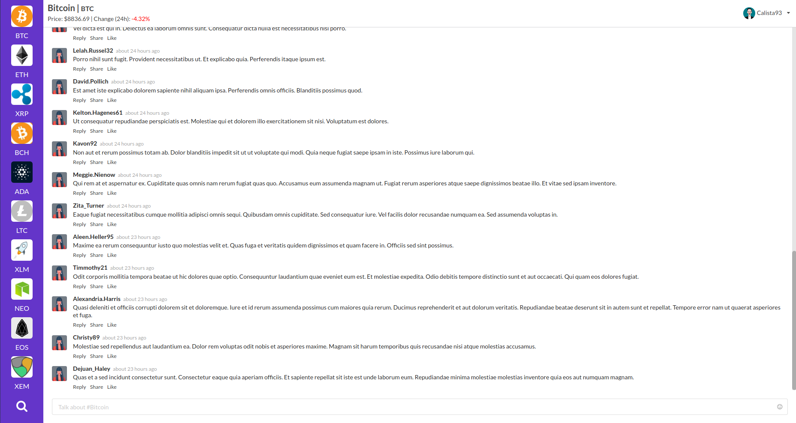

# bth_ramverk2 - Project - react_Express_frontend

[](https://travis-ci.org/Zero2k/bth_ramverk2_project_frontend)
[](https://bettercodehub.com/)
[](https://scrutinizer-ci.com/g/Zero2k/bth_ramverk2_project_frontend/?branch=master)
[](https://scrutinizer-ci.com/g/Zero2k/bth_ramverk2_project_frontend/?branch=master)
[](https://scrutinizer-ci.com/g/Zero2k/bth_ramverk2_project_frontend/build-status/master)

## Dependencies

 * [Node.js](https://nodejs.org/en/)
 * [React.js](https://reactjs.org/)
 * [Apollo GraphQL - Client](https://www.apollographql.com/client)

## Follow these steps to start the frontend.
```bash
- GETTING STARTED
1. git clone https://github.com/Zero2k/bth_ramverk2_project_frontend frontend
2. cd frontend
3. yarn - install dependencies
4. yarn start - start the frontend
```

# Further documentation



## About

This repo is part of a school project at Blekinge Institute of Technology and it contains the front-end for my examination assignment in the course Ramverk2. In short, the task is to create a service / application where we use techniques that we have tested / learned in the course, we was free to choose any modern front-end technology we like, so i decided to use React.js for this project. Learn more about my backend built with Node.js, Express.js, GraphQL and MongoDB [here](https://github.com/Zero2k/bth_ramverk2_project_backend). 

## Features

[✔] Login & Sign-up for users  
[✔] Protected routes which require authentication to access  
[✔] Real-time chat  
[✔] Search cryptocurrencies with autocomplete  
[✔] Easy access to ten of the largest cryptocurrencies  
[✔] Market data for cryptocurrencies such as price and price changes  
[✔] Change user settings  
[✔] Pagination with infinite scroll

## Technologies - React

I decided to use React for my front-end and here is how i structured it. First of all, the front-end was bootstrapped with Create React App in order to get a good foundation to start with. In addition, it accelerates the development process since i don't have to install a lot of packages manually and create all the files needed.

## How to deploy the app to DigitalOcean

Requirement:

* [Frontend](https://github.com/Zero2k/bth_ramverk2_project_frontend)
* [Backend](https://github.com/Zero2k/bth_ramverk2_project_backend)
* [Node.js](https://nodejs.org/en/)
* [MongoDB](https://www.mongodb.com/)
* [pm2](http://pm2.keymetrics.io/)
* [NGINX](https://nginx.org/en/)

This guide assumes you already have an account on DigitalOcean.com and you know how to start and connect to a Ubuntu Droplet via SSH.

The first step is to update apt and install npm. So start by using the command:

```bash
sudo apt-get update && sudo apt-get install npm
```

Then install node: 

```bash
curl -sL https://deb.nodesource.com/setup_9.x | sudo -E bash -
sudo apt-get install -y nodejs
```
*This will install the latest version of node which currently is 9.5.0*

This next step is optional and not required to get the application to work. However, i like the tool Yarn over NPM so i want to install it. In order to do so, use the following commands:

```bash
curl -sS https://dl.yarnpkg.com/debian/pubkey.gpg | sudo apt-key add -
echo "deb https://dl.yarnpkg.com/debian/ stable main" | sudo tee /etc/apt/sources.list.d/yarn.list

sudo apt-get update && sudo apt-get install yarn
```

The last thing we need in order to get the back-end to work is a database. This application uses MongoDB, so you will need to install it.

Start by running this commands:

```bash
sudo apt-key adv --keyserver hkp://keyserver.ubuntu.com:80 --recv 2930ADAE8CAF5059EE73BB4B58712A2291FA4AD5
```
*This will import the public key used by the package management system.*

Next, you will need to create a list file for MongoDB

```bash
echo "deb [ arch=amd64,arm64 ] https://repo.mongodb.org/apt/ubuntu xenial/mongodb-org/3.6 multiverse" | sudo tee /etc/apt/sources.list.d/mongodb-org-3.6.list
```

The last thing you need to install is MongoDB itself by using these commands:

```bash
sudo apt-get update

sudo apt-get install -y mongodb-org

sudo apt-get install -y mongodb-org=3.6.2 mongodb-org-server=3.6.2 mongodb-org-shell=3.6.2 mongodb-org-mongos=3.6.2 mongodb-org-tools=3.6.2
```

If everything was installed correctly, then you should be able to start the database:

```bash
sudo service mongod start
```

*The installations above is all you'll need to get the back-end to work, but there is one more tool you will need to get the front-end to work and its NGINX and configure it as a Reverse Proxy.*

So, let's download if from apt-get:

```bash
sudo apt-get install nginx
```

Once it has installed, you can configure the virtual host to run on the front end.

Start by open up the nginx configuration to see how it looks like:

```bash
sudo vim /etc/nginx/sites-available/default
```

In this file, there's alot of documentation and code that we don't need so usually i just recreate it to get an empty file.

```bash
cd /etc/nginx/sites-available
sudo rm default
touch default
```

Once you have a empty file, you can open it with vim using: 

```bash
sudo vim default
```

And enter the follwoing code and change SERVER_IP to the actual IP:

```bash
server {
  listen 80;

  server_name SERVER_IP;

  location / {
    proxy_pass http://SERVER_IP:3000;
    proxy_http_version 1.1;
    proxy_set_header Upgrade $http_upgrade;
    proxy_set_header Connection 'upgrade';
    proxy_set_header Host $host;
    proxy_cache_bypass $http_upgrade;
  }
}
```

Then save the file and restart NGINX with: 

```bash
sudo service nginx restart
```

Now the server is ready to handle both the back-end and front-end so let's set it up.

Start by downloading the files from github:

```bash
git clone https://github.com/Zero2k/bth_ramverk2_project_frontend.git frontend

git clone https://github.com/Zero2k/bth_ramverk2_project_backend.git backend
```

I usually download the files to the root, but you could probably place it anywhere you want. So once the download is complete you can cd into backend and frontend. Use the command 'yarn' in both folders to install all dependencies. 

Once the dependencies is install, you can start both the back-end and front-end with the command yarn start, but this will not allow you to run both services at the same time, also one problem with DigitalOcean is if you just start the back-end or front-end with yarn start and then close the SSH connection, then the service will be closed.

So to fix this, we need a way to run both the back-end and front-end in the background and keep them alive once the SSH connection is closed and potentially even restart the backend if it crash.

To achieve this there is a few tools you can use such as forever, screen and [pm2](http://pm2.keymetrics.io/) which i personally like since it require very little configuration and i have already written startup commands in both the back-end and front-end package.json.

The last thing you will need to do is set the IP in the front-end so it know how to connect to the server. Open constants.js in frontend and add the IP.

```bash
sudo vim frontend/src/utils/constants.js
```

#### Start Front-end

```bash
cd frontend
yarn build
yarn start:production
```

#### Start Back-end
```bash
cd backend
yarn build
yarn start:production
```

This is all you need to deploy the application to DigitalOcean.
